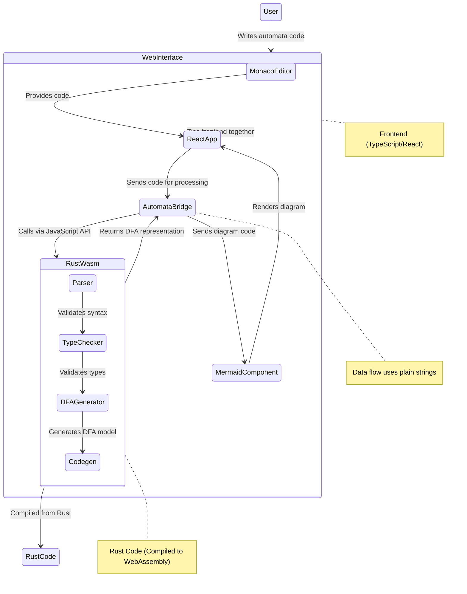

# Automata Project Architecture

This document provides a high-level overview of how the uncRUSTables automata project components are connected, from the Rust backend to the web interface.

## Component Architecture Diagram

## Component Descriptions

### Web Interface (Frontend)

- **React App**: Main application container that manages state and UI
- **Monaco Editor**: Code editor component (same as VS Code) with syntax highlighting
- **Theme Context**: Manages light/dark theme for the application
- **AutomataBridge**: Service that interfaces with the Rust code compiled to WebAssembly
- **Mermaid Component**: Renders the DFA diagrams using Mermaid.js

### Rust Components (compiled to WebAssembly)

- **Parser**: Parses automata language syntax
- **Type Checker**: Validates semantics of automata programs
- **DFA Generator**: Converts validated program to DFA representation
- **Codegen**: Generates serializable DFA representation that can cross the WebAssembly boundary

## Data Flow

1. User writes automata code in Monaco Editor
2. On clicking "Visualize", code is sent to AutomataBridge
3. AutomataBridge calls the Rust code compiled to WebAssembly functions
4. Rust WebAssembly code processes the automata program:
   - Parses syntax using the Parser module
   - Validates semantics with the TypeChecker module
   - Generates DFA representation with the DFA Generator
   - Uses codegen.rs to create a serializable representation that can cross the WebAssembly boundary
5. DFA data is returned to AutomataBridge
6. AutomataBridge converts DFA to Mermaid diagram syntax
7. Mermaid component renders the diagram

## Future Enhancements

The current implementation uses a mock DFA generator in `AutomataBridge.ts`. The planned WebAssembly integration will replace this with actual Rust-compiled WebAssembly code for automata parsing and DFA generation. This will involve completing the codegen.rs file to generate a DFA representation that can be serialized across the WebAssembly boundary.
