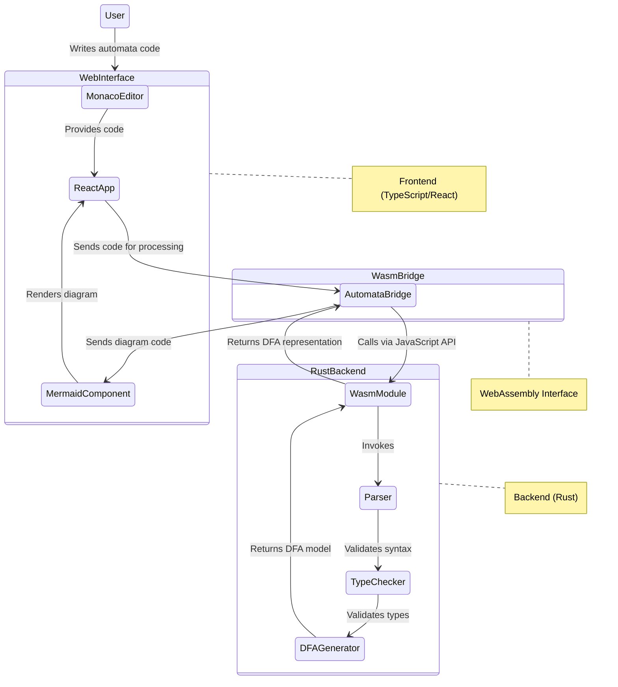

# Automata Project Architecture

This document provides a high-level overview of how the uncRUSTables automata project components are connected, from the Rust backend to the web interface.

## Component Architecture Diagram

## Component Descriptions

### Web Interface (Frontend)
- **React App**: Main application container that manages state and UI
- **Monaco Editor**: Code editor component (same as VS Code) with syntax highlighting
- **Theme Context**: Manages light/dark theme for the application
- **AutomataBridge**: Service that connects to the WebAssembly module
- **Mermaid Component**: Renders the DFA diagrams using Mermaid.js

### WebAssembly Bridge
- **WASM Module**: Compiled Rust code exposing JavaScript APIs
- Provides two main functions:
  - `parse_program`: Parses automata code
  - `generate_dfa`: Converts parsed representation to DFA

### Rust Backend
- **Parser**: Parses automata language syntax
- **Type Checker**: Validates semantics of automata programs
- **DFA Generator**: Converts validated program to DFA representation

## Data Flow

1. User writes automata code in Monaco Editor
2. On clicking "Visualize", code is sent to AutomataBridge
3. AutomataBridge calls WebAssembly module functions
4. Rust code processes the automata program:
   - Parses syntax
   - Validates types
   - Generates DFA representation
5. DFA data is returned to frontend
6. Frontend converts DFA to Mermaid diagram syntax
7. Mermaid component renders the diagram

## Future Enhancements

The current implementation uses a mock DFA generator in `AutomataBridge.ts`. The planned WebAssembly integration will replace this with actual Rust-compiled WebAssembly code for automata parsing and DFA generation.