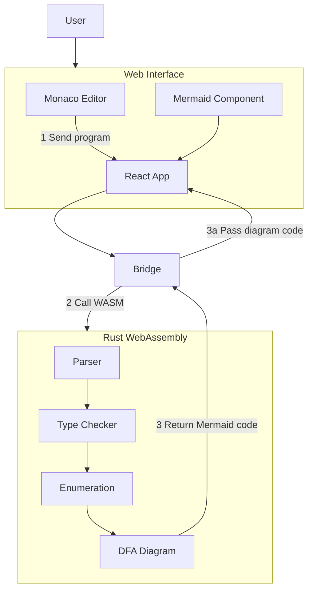

# WebUI Architecture

This document provides a high-level overview of how the uncRUSTables automata project components are connected, from the Rust backend to the web interface.

## Component Architecture Diagram

> **Note:** The numbers in the diagram represent the sequence of operations in the data flow.

## Component Descriptions

### Web Interface (Frontend)

- **React App**: Main application container that manages state and UI
- **Monaco Editor**: Code editor component (same as VS Code) with syntax highlighting
- **Theme Context**: Manages light/dark theme for the application
- **Bridge**: Service that interfaces with the Rust code compiled to WebAssembly
- **Mermaid Component**: Renders the DFA diagrams using Mermaid.js

### Rust Components (compiled to WebAssembly)

- **Parser**: Parses automata language syntax
- **Type Checker**: Validates semantics of programs
- **Enumeration**: Generates the DFA states based on the `.un` program
- **DFA Generator/Printer**: Processes DFA states and creates Mermaid diagram syntax directly

## Data Flow

1. User writes automata code in Monaco Editor
2. On clicking "Visualize", code is sent to  Bridge
3. Bridge calls the Rust code compiled to WebAssembly functions
4. Rust WebAssembly code processes the automata program:
   - Parses syntax using the Parser module
   - Validates semantics with the TypeChecker module
   - Generates DFA states with the Enumeration module
   - DFA module directly produces Mermaid diagram syntax from these states
5. Mermaid diagram code is returned to Bridge
6. Bridge passes the Mermaid diagram code to the Mermaid component
7. Mermaid component renders the diagram
